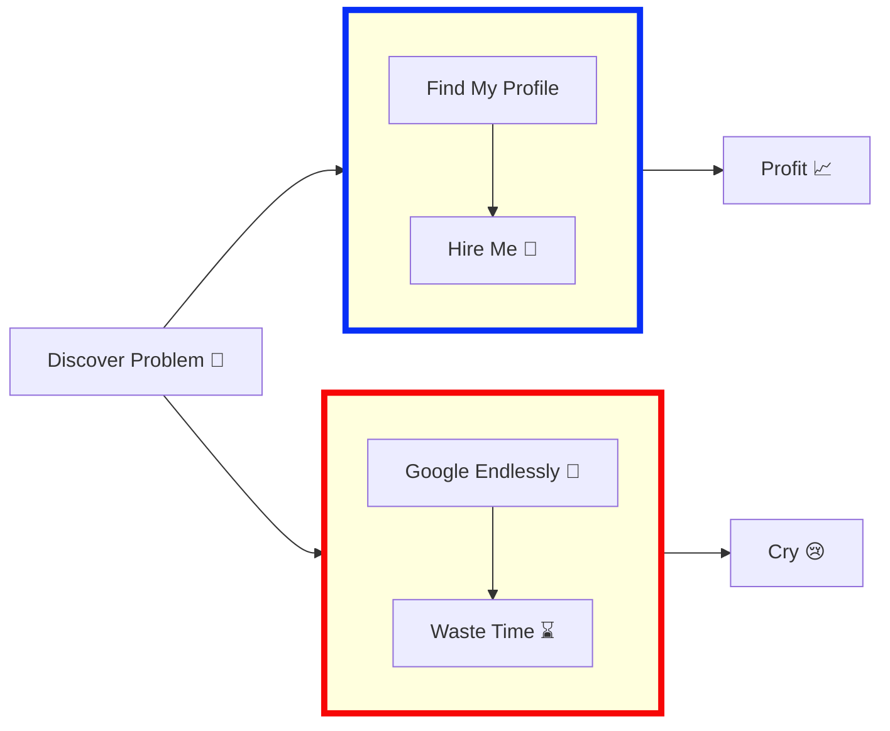

## 👋🏻 I can automate/bot anything 
**As a programmer, it is your job to put yourself out of business. What you do today can be automated tomorrow 🤖 (Doug McIlroy)**

**Never spend 6 minutes doing something by hand when you can spend 6 hours failing to automate it 👷 (Zhuowei Zhang)**

**Automated testing is a safety net that protects the program from its programmers 🐛 (Yegor Bugayenko)**

---

## 🛠️ Stack

---

## 📦 Projects
**🌐 Personal Portfolio** — `kalophain-portfolio`
> Building reliable back-end systems. Growing every single day.

 

**☕ Java Projects** — `apple calculator`
> Apple-vibe Calculator & more Java experiments.

  

---

## 🚀 About Me
I am a Java Backend Developer with a passion for problem-solving and building reliable systems. With hands-on experience developing Java applications and REST APIs, I bring a focused perspective to backend software development.

---

## 💻 Skills & Expertise
### Coding Languages:
| Language | | 
|---|---|
| Java |  |

### Tools & Technologies:
| Category | Tools |
|---|---|
| Frameworks | Spring Boot |
| APIs | REST API |
| Version Control | Git |
| Cloud | AWS (Coming Soon) |

---

## 📫 Let's Connect!
Feel free to reach out for collaboration opportunities, technical discussion, or just to say hi!

---

